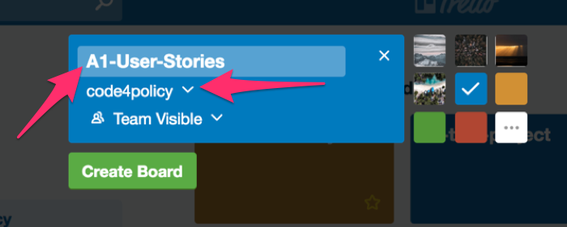

## Remember

* **Individuals and interactions** over processes and tools
* **Working software** over comprehensive documentation
* **Customer collaboration** over contract negotiation
* **Responding to change** over following a plan

## Getting Started

- Before we start, assign a "product owner" and a "scrum master" in your group.

### Setting up a Trello board

The product owner can create a task board on trello. Make sure to start the board with the name of your group, for example `A1`.

## StoryTime Meeting

**Write User Stories**

Talk among your group and start capturing user stories for your project. Its okay if they seem beyond the scope of what you think is possible in two one-week sprints. You may not ultimately get to some of these and that's alright. This is an exercise in understanding the users needs, and envisioning what the product could be. Remember, a story is not a contract, it is an invitation to a discussion. 

This isn't just a hokey exerecise you have to do, so don't slack off or settle for bad user stories. This is really a conversation about what the final product will look like. Take each discrete story and put it on a notecard. Here is an example:

> **As a** design student applying for jobs
>
> **I want** a website that looks good
>
> **So that** I can use it in my portfolio

Your group may or may not care about the look and feel of the site. You may say decide that you'll spend time doing original analysis, you'd prefer an ugly site that gets a point across.

> **As a** activist
>
> **I want** a website that tells a clear story
>
> **So that** I can use it to convince people about my cause

Perhaps you would like to use this as an opportunity to build on or visualize data work you've already done

> **As a** person who has spent a lot of time doing impressive quantitative analysis on New York City's garbage collection for my thesis
>
> **I want** to visualize the data in my thesis
>
> **So that** I can more effectively communicate the importance of this work to others

Or maybe your group has a lot of members working remotely.

> **As a** group that is working remotely
>
> **I want** a site with one discrete page and dataset per group member
>
> **So that** it is less difficult to coordinate if we're all working on separate pages.

Or perhaps you just want a good grade

> **As a** student who cares about my GPA
>
> **I want** to make sure the requirements for the project are met and documented
>
> **So that** nothing gets left out and we get a good grade in the class.
 
These should be **real** user-stories that help guide your  actual project, not hypothetical ones. They should define what you and your teammates hope to build, so be honest about who your users are. During this first stage your stories don't have to be super refined, we will think more about INVEST and the definitions of done in the next part.

**Organize and Refine User Stories**

1. Groom your user story backlog - take the most important user stories and put them at the top of the stack. Put the less important ones in rough order of importance at the bottom of the stack.
2. Refine stories at the top of your stack
	1. combine the ones that are the same
	2. remove the ones that have no value
	3. split the ones that are too big
3. Select the most important stories, and make sure they meet I-N-V-E-S-T and have a strong definition of done. Enter them into the top of a trello list called "USER STORIES".
	1. use a checklist to make sure they meet I-N-V-E-S-T
	2. add definition of done
	3. add acceptance criteria / definitions of done

**Planning poker**

1. Make flash cards with these numbers on them

 	`0, 1, 2, 3, 5, 8, 13, 21, 40, 100, ? and ∞`

2. Lets calibrate. First the product owner (in this case me) will present each story and explain what it means. The group will ask questions to clarify what exactly the stort is. Then we'll have a round of poker.

	> **As a** group member,
	> **I want** to select a topic to work on
	> **So that** we can get started on our project

	> **As a** scrum master
	> **I want** to plan our daily team scrum meeting time for this weekend
	> **So that** we are all on the same page about our progress every day and can plan our weekends accordingly.

	> **As a** product owner
	> **I want** to decide how many datasets we're going to take on
	> **So that** i know how collaboratively we will need to work this weekend.

	> **As a** student with a quantiative background
	> **I want** to analyze a dataset
	> **So that** i can use it next week in my project

	> **As a** student without a quantitative background
	> **I want** to find a preexisting dataset
	> **So that** i can use it next week in my project

	> **As a** person who has already found a dataset
	> **I want** to decide which visualization would best suit that dataset
	> **So that** i can think about how i might use it in my project

	> **As a** person who knows how to build a basic website with some text and images, but not how to do interactive visualizations
	> **I want** to build out a text only version of my website
	> **So that** I can have an MVP for the first sprint of this project.

1. Now lets do it in the context of a particular group's project. Lets do one or two cards for a volunteer group with the whole class and then we'll break off.
	1. Product owner presents a task
	2. Product owner solicits questions to make sure everyone is on the same page about what is included in that task and what is not.
	3. Poker commences - estimate the size of each story with one of these values
 	`0, 1, 2, 3, 5, 8, 13, 21, 40, 100, ? and ∞` Using the methodology described here: 	https://en.wikipedia.org/wiki/Planning_poker
	4. Either agree on a consensus, or discuss further and do another round of poker.
2. Now lets turn it over to the groups to do that with the rest of the tasks for this sprint.

