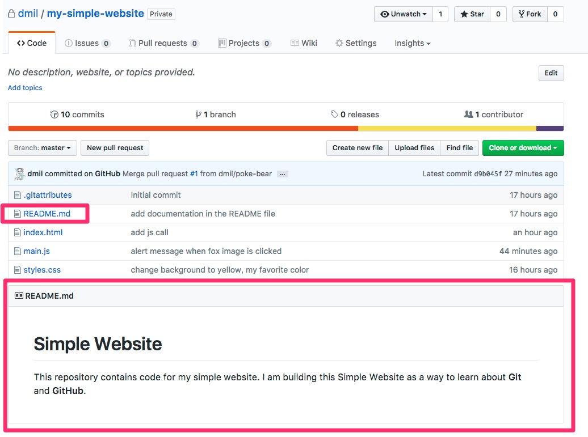
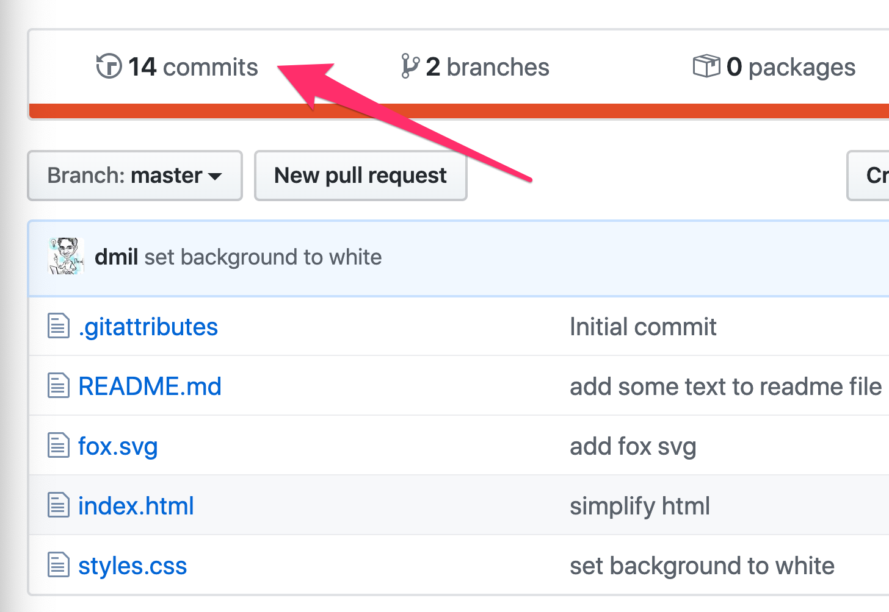
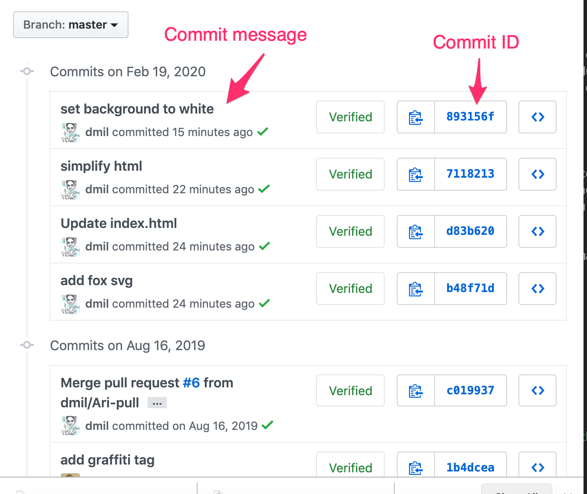
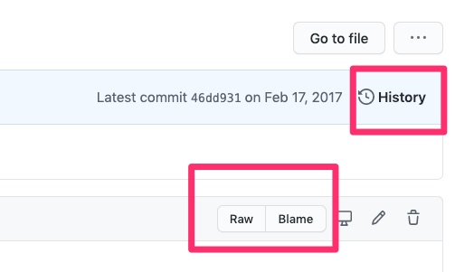
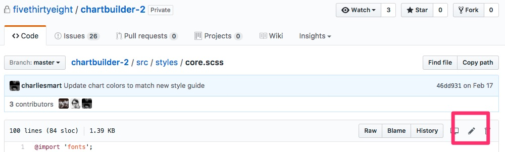
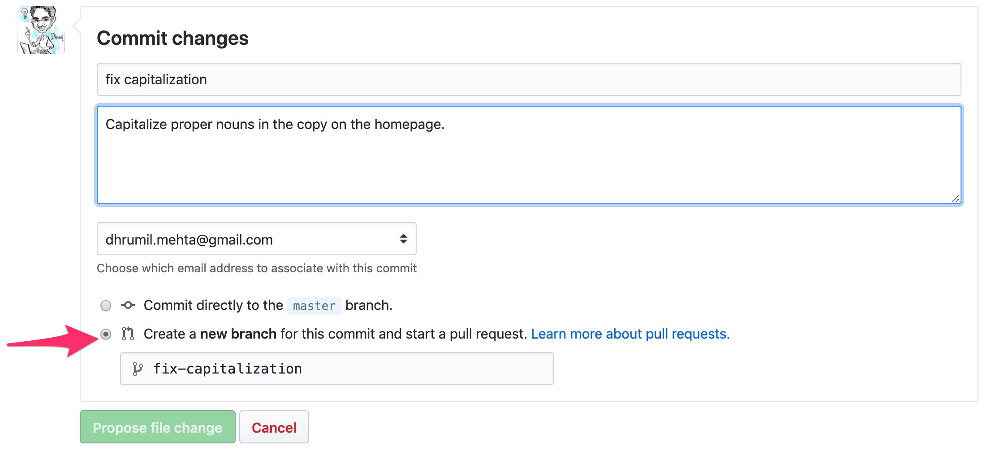
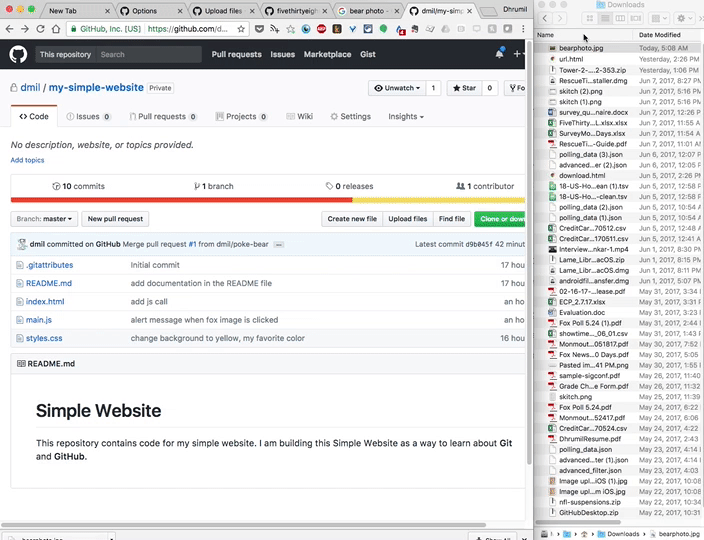
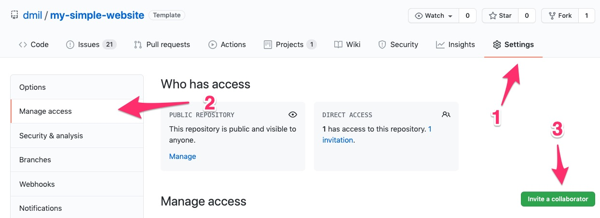
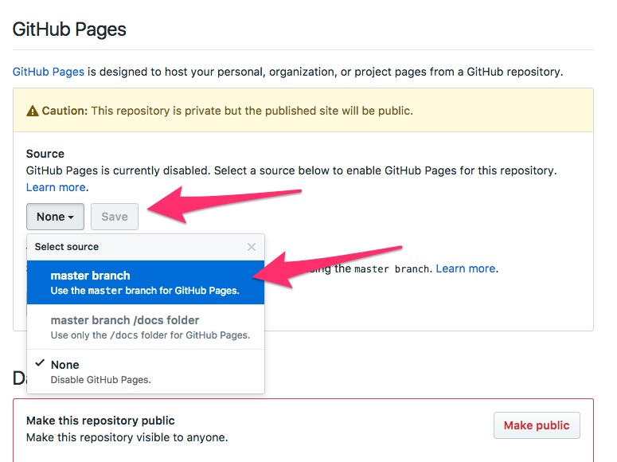

# GitHub Introduction

GitHub is a place for:
 
1. **Storing and viewing your Git repositories**
1. **Collaborating on coding projects within an organization** 
2. **Open Source Collboration**: People in other organizations or complete strangers can see your code and [participate with you on your project](https://github.com/fivethirtyeight/actblue-analysis). They can suggest fixes, point out errors, and start discussions. You can find other people's work, and make sure you're not duplicating something that already exists. Or you can interact with someone who has already worked on something similar to what you're trying to tackle.
3. **Web Hosting**: The "Github Pages" feature allows you to host a static website for free, right on GitHub.

Other Uses

* A place to store code
* A place to [store data](https://github.com/fivethirtyeight/data)
* A place for [discussion](https://github.com/fivethirtyeight/data/issues?q=is%3Aissue+is%3Aclosed+sort%3Acomments-desc) about data and code
* A place for [open source](https://github.com/fivethirtyeight/data/pulls?q=is%3Apr+is%3Aclosed+sort%3Acomments-desc) [collaboration](https://github.com/tj/git-extras/pull/356) on projects
* A place for [collaboration](https://github.com/fivethirtyeight/world-cup/graphs/contributors) [within](https://github.com/fivethirtyeight/letsgo/pull/46) an organization
* A place to find people working on the same things you are
* A place to find sources / people with expertise in a particular dataset
* A place to find other digital tools ([scrapers](https://github.com/search?q=basketball+reference&type=Repositories&utf8=%E2%9C%93), [file converters](https://github.com/search?utf8=%E2%9C%93&q=spss+por+to+csv&type=), etc)
<!-- Search "spss por to csv"-->
* A place to find open source work and analysis
* A [portfolio](https://github.com/dmil) of your technical work (or technical learning)

## Lets Dive In!

Vocab
	
* **local repository** a folder stored on your computer
* **remote repository** a folder stored on on GitHub  

Lets take a look at a repository that is on GitHub.

* https://github.com/code4policy/simple-website

## (Some of) GitHub's Features

### The `README.md` file

Github looks for a "readme" file and renders it as you're navigating through the file structure. This is a great way to guide people through your code.




Readme files are often given the `.md` extension, meaning they're written in a language called markdown that allows for nicer formatting. You can check out this [markdown cheet sheet](https://www.markdownguide.org/cheat-sheet/) (https://www.markdownguide.org/cheat-sheet/) if you want to see how formatting works, but you can also save a readme files as plain text. Github will also detect `.txt` files, or you can just write plain text inside your `.md` file.


### Commit Log



Vocab

* **commit** - the basic unit of a git repository is a commit. It is a set of changes to a file. A commit usually comes with an **commit id** as well as a **commit message** that describes the change.

* **commit log** (aka Git History) - all of the commits (previous changes) to all of the files in your repository


https://github.com/dmil/my-simple-website/commits/master

### History, Raw, and Blame for any file



* **Raw** - actual contents of the file without any formatting applied.
	* example: https://github.com/fivethirtyeight/chartbuilder-2/blob/master/src/styles/core.scss 
* **History** - every change ever made to that file within this branch.
	* example: https://github.com/fivethirtyeight/chartbuilder-2/commits/master/src/styles/core.scss
* **Blame** - provenance of each line currently in the file you'ree looking at in the branch you're looking at
	* example: https://github.com/fivethirtyeight/chartbuilder-2/blame/master/src/styles/core.scss

### Branches


### Pull Requests
	
	
	
	

### Proposing Edits


You can edit a file in GitHub in a new branch, thus proposing a change without actually making the change in the master branch. Just make sure to leave a meaningful description of the change you made in the commit message.



### Drag and Drop


### Collaboration

Collaborators can push to the repository without asking your permission, they have full read and write access.



If I wasn't a collaborator, I could still work with you on an open source project through a process called forking where I can make a copy of your repository in my GitHub account, make changes, and request that you merge them back into your project. We will discuss forking more in depth later.

### Serving up Websites!

GitHub is also great for serving up static websites. Right now, you have the code for your website on GitHub, but its not being served up anywhere. GitHub is only storing the code. Luckily, if your code happens to be a website, GitHub can also host it for you through a feature called "GitHub Pages". 

Simply go to the "settings" menu, scroll down to "GitHub Pages", and select "master branch"



Whatever is in your master branch on GitHub should now appear at 

```
http://your-username.github.io/repository-name
```

in my case it is [**http://dmil.github.io/my-simple-website**](http://dmil.github.io/my-simple-website)

## GitHub for things other than code
* Auditing system for changes on a file
* For collaboratively editing a text document
* [For drafting government web design standards!](https://github.com/18F/web-design-standards)
* Open [comment period](https://github.com/whitehouse/source-code-policy/issues?q=is%3Aissue+is%3Aclosed) for policy
* [Drafting](https://github.com/twitter/innovators-patent-agreement) and [collaborating on](https://github.com/twitter/innovators-patent-agreement/issues) legal documents
* Design (image diff) 
	* https://help.github.com/articles/rendering-and-diffing-images/
* Open journalsim showcase
	* 	https://github.com/showcases/open-journalism
* Github for Government
	* https://government.github.com/
	* https://government.github.com/community/


