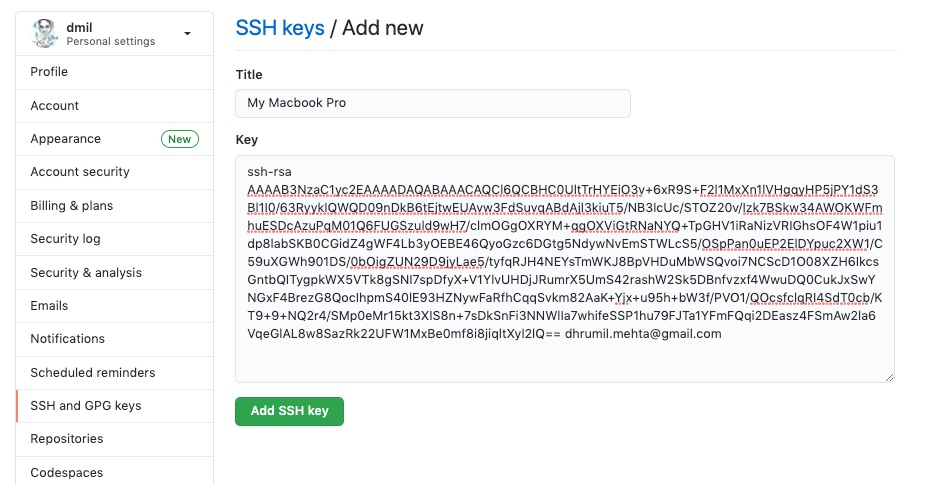

# Git: SSH and Encryption

In order to write code locally on our computer and be able to push to GitHub (or pull from GitHub) daily without constantly having to enter a username and password each time, we're going to set up **SSH keys**. 

> SSH keys come in pairs, a public key that gets shared with services like GitHub, and a private key that is stored only on your computer. If the keys match, you're granted access.
>
> The cryptography behind SSH keys ensures that no one can reverse engineer your private key from the public one.
>
> source: https://jdblischak.github.io/2014-09-18-chicago/novice/git/05-sshkeys.html


## Setup

The following steps are a simplification of the steps found in [GitHub's documentation](https://docs.github.com/en/free-pro-team@latest/github/authenticating-to-github/connecting-to-github-with-ssh). If you prefer, feel free to follow the steps at that link. Otherwise, for a simplified experience continue on below!

### Simplified Setup Steps

1. **Step 1:** Check to see if you already have keys.

	Run the following command.

	```
	ls -al ~/.ssh/
	```

	If you see any output, that probably means you already have a public and private SSH key. If you have keys, you will most likely you will have two files, one named `id_rsa` (that contains your private key) and `id_rsa.pub` (that contains your public key).

	_**sidenote**: Those files may also be named something like: `id_ecdsa.pub` or `id_ed25519.pub`. That just means you're using a different encryption algorithm to generate your keys. You can learn [more about that here](https://medium.com/risan/upgrade-your-ssh-key-to-ed25519-c6e8d60d3c54) if you chose to. Or, don't worry about it and power on!_


	If you already have keys, continue to step 3. Otherwise, read on!

2.  **Step 2:** Create new SSH keys.

	Run the following comamnd, but makes sure to replace `your_email@example.com` with your own email address. Use the same email address you used to sign up to GitHub with.

	```
	ssh-keygen -t rsa -b 4096 -C "your_email@example.com"
	```

	You may then see a prompt like the one below. Just hit enter to save the key in the default location.

	```
	Enter file in which to save the key (/Users/mehtad/.ssh/id_rsa):
	```

	After that, the system will prompt you to enter a passphrase. We're **not** going to use a passphrase here, so just go ahead and leave that blank and hit enter twice.

	```
	Enter passphrase (empty for no passphrase):
	Enter same passphrase again:
	```

	Finally you should see some randomart that looks like this

	```
	Your identification has been saved in /Users/mehtad/.ssh/id_rsa.
	Your public key has been saved in /Users/mehtad/.ssh/id_rsa.pub.
	The key fingerprint is:
	SHA256:2AazdvCBP8d1li9tF8cszM2KbtjPe7iwfCK8gUgzIGY your_email@example.com
	The key's randomart image is:
	+---[RSA 4096]----+
	|                 |
	|       .     o * |
	|  E . = .   . B.*|
	| o . . X o . + =o|
	|      B S o . o =|
	|     o * + +   o.|
	|      . ..o =  . |
	|          o+.=o .|
	|          .ooo=+ |
	+----[SHA256]-----+
	```

3. **Step 3:** Add your key to GitHub

	Run the following command to view your public key

	```
	cat ~/.ssh/id_rsa.pub
	```


	Navigate to https://github.com/settings/keys and hit "New SSH key". Paste the SSH key from the last command into the text box as shown below and then hit "Add SSH key". Make sure you copy paste exactly. The key will likely start with ssh_rsa and end with your email address. You can give the key a title like "My Macbook Pro" so you know which computer this key comes from.

	

4. **Step 4:** Verify that it worked!

	Run the following command to test your computer's SSH connection to GitHub

	```
	ssh -T git@github.com
	```

	If the connection is successful, you will see a message like this

	```
	> Hi username! You've successfully authenticated, but GitHub does not
	> provide shell access.
	```

### Recap: What did we just do?

We just created a public/private SSH Key pair. There is now a folder on your computer called `.ssh` *(it is a hidden folder, hidden folders have names that start with `.`)*. You can run this command to see the files in that folder.

```
ls -al ~/.ssh/
```

`id_rsa.pub` contains your **public key**, you can see what that looks like by running:

```
cat ~/.ssh/id_rsa.pub
```

`id_rsa` contains your **private key**, you can see what that looks like by running:

```
cat ~/.ssh/id_rsa
```

This public and private key pair are mathematically linked. As the name suggests, you can share your **public key** far and wide, but must keep your **private key** safe and secure. Since you have shared your public key with GitHub, your computer can encrypt files with your private key and send them to GitHub. Since GitHub has your public key, it can match that file and verify that it is coming from you. Your computer can now securely communicate with GitHub without needing a username and password every time.


## Cryptography Basics

A brief aside...

A system with a public and private key is known as asymmetric encrpytion, or private key encryption. Check out this video from [David Brumly at Carnegie Mellon University](https://www.youtube.com/watch?v=fNC3jCCGJ0o) for a quick overview of the basics of cryptography.

[](https://www.youtube.com/watch?v=fNC3jCCGJ0o)

### What can you do with cryptographic keys?

* Share our public key to securely communicate with GitHub (or other services).
* Use someone else's public key to [encrypt](https://gist.github.com/colinstein/de1755d2d7fbe27a0f1e) and send a message only they can read.
* Encrypt or sign a document with your private key to prove that it originated with you (anyone can use your public key to decrypt, or verify your signature)
* Remotely login into another computer with a program known as secure shell (`ssh`).
* Copy a file securely from another computer using secure copy (`scp`).
* Lots of other things....

### So this is what encryption is all about?

Yeah, its a really powerful tool that doesn't require a geeky genius to use.

### Other applications

* Encrypting Files: https://bjornjohansen.no/encrypt-file-using-ssh-key
* HTTPS (We'll cover this more in a later lesson)

	[](https://www.youtube.com/watch?v=w0QbnxKRD0w)

	- https://18f.gsa.gov/2014/11/13/why-we-use-https-in-every-gov-website-we-make/
	- https://https.cio.gov/
* Cryptocurrency: https://walletgenerator.net/
* Chat (Signal, WhatsApp, Ketbase etc... are end-to-end encrypted chat platforms)
* Digital Signatures: https://us-cert.cisa.gov/ncas/tips/ST04-018
* Voting (in Estonia, at least): https://www.youtube.com/watch?v=GuKiJKL4WdI
* Identification https://www.youtube.com/watch?v=9POUIiyhowk

Check out [this video](https://www.youtube.com/watch?v=9POUIiyhowk) about all of the digital services Estnoia has been able to provide by issuing a public/private key pair to each citizen:

[](https://www.youtube.com/watch?v=9POUIiyhowk)

### Want to try it out?

Finally, if you want to play around more with encryption, I'd highly reccomend [Keybase](https://keybase.io/). Keybase allows you to encrpyt messages as you can see in the gif below using someone else's public key. Then, you can send that message to them over any public medium and ONLY they can read it. You can also encrypt a message with multiple keys. Keybase has a lot of other great features including secure chat, idenity verification, file transfer, and more. I would encourage you to play around with it and learn more and really bring the idea of public and private keys to life!


Later in class, if there is time, we will learn how to send each other encrypted messages using the SSH keys we just created today! ([modules/security/encryption.md](../security/encryption.md#-example))

### Misc

The math behind Cryptography has something to do with finding the factors of really large prime numbers. This article on arstechnica provides a great rundown!
https://arstechnica.com/information-technology/2013/02/lock-robster-keeping-the-bad-guys-out-with-asymmetric-encryption/

## Questions?

Discuss with your classmates in the #encryption channel in Slack! If I'm around, I can chime in too. Or ask me during class!

