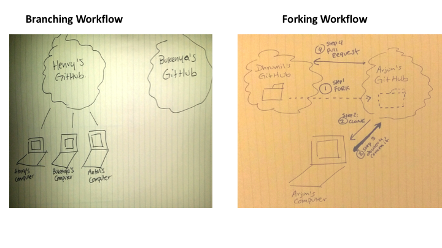

# Git 7: Forking

## Key Terms

* **fork** - make a copy of a remote repo on GitHub from one account to another.
* **pull request** - ask the upstream maintainer to pull in changes from origin.
* **upstream** - the name for a remote read-only repository
* **origin** - the name for a remote read-and-write repository

## A Typical Setup for Forked Code


## Branching vs Forking

* **Branching** is a feature of Git, you've used branching already
* **Forking** is a feature of GitHub
	* A fork is a personal copy of another user's repository that lives on your account. Forks allow you to freely make changes to a project without affecting the original. Forks remain attached to the original, allowing you to submit a pull request to the original's author to update with your changes. You can also keep your fork up to date by pulling in updates from the original. - [GitHub Glossary](https://help.github.com/articles/github-glossary/)
	*  When you fork a repository, you get all of the branches the other person posted on GitHub
	*  Pull requests however, don't acknowledge forks since they are a feature of GitHub and not Git. So while you can colloquially say "I'm issuing a pull request from my fork to yours", really what you're saying is "I'm issuing a pull request from the master branch of my fork to the master branch of your fork". You can actually issue a pull request from any branch in your forked repository to any branch in the original repository.



Here is a good example repository that makes use of issues and pull requests: https://github.com/openelections/


##  Example (shorter - no local repository)

1. Step 1: Fork my repository [`dmil/simple-website`](https://github.com/dmil/simple-website).

2. Go to Settings > GitHub Pages and select the "master" branch as the source. Wait a few seconds and then go to http://`your-username`.github.io/simple-website to make sure github pages is set up correctly.

3. Normally I'd clone the forked repository locally onto my computer, push changes to the fork, then issue a pull request. For the sake of time lets cut that step out. Make **one** small edit in your fork of this code **directly in GitHub**.

4. Create a pull request. Note that this time we are creating pull request across repositories instead of just across branches within the same repository. The `base` will be `dmil/simple-website/master` while the `compare` will be `your-username/simple-website/master`.

5. Compare your website http://`your-username`.github.io/simple-website to mine: http://dhrumilmehta.com/simple-website/

6. I will now merge your pull requests and we can see what changes you all make to the website over time. There's a good chance we may run into some merge conflicts as well.

##  Example (Longer)

1. Step 1: Fork my repository [`dmil/simple-website`](https://github.com/dmil/simple-website).

2. Go to Settings > GitHub Pages and select the "master" branch as the source. Wait a few seconds and then go to http://`your-username`.github.io/simple-website to make sure github pages is set up correctly.

3. Clone the forked repository to your Development folder.
	
	```
	git clone git@github.com:XXXX/XXXX.git
	```

4. Create a feature branch with your name.

	```
	git checkout -b <your name>
	```

5. Make a random change.

6. Commit and push the change.
	
	```
	git commit -m "describe your random change here"
	git push
	```

7. Create a pull request. Note that this time we are creating pull request across repositories instead of just across branches within the same repository. The `base` will be `dmil/simple-website/master` while the `compare` will be `your-username/simple-website/feature-branch-name`.

8. Create another pull request within the fork itself where the base is your own master branch. More explicitly, the base is `your-username/simple-website/master` and the compare is `your-username/simple-website/feature-branch-name`. Merge this pull request. 

	*Note: Draw diagram on board*

9. Compare your website http://`your-username`.github.io/simple-website to mine: http://dhrumilmehta.com/simple-website/

10. I will now merge your pull requests and we can see what changes you all make to the website over time. There's a good chance we may run into some merge conflicts as well.

### Woohoo! You just collaborated open-source.

Open source collaboration is great for:

* Not duplicating work
* Collaborating accross organizations
* Interacting with people - sometimes making an issue or a pull request can lead to friendship (or sources or collaborators)
* Reader feedback
* [Collective debugging](https://github.com/themarshallproject/klaxon/issues/107), finding critical [errors](https://github.com/fivethirtyeight/data/pull/54) faster (often also leads to better security and better data quality).
* [Building upon](https://twitter.com/ascheink/status/783394500710457344) someone else's project
* [Feuding](https://github.com/jashkenas/underscore/issues/2182)
* [Philosophical](https://www.gnu.org/philosophy/shouldbefree.en.html) [Reasons](https://www.gnu.org/philosophy/open-source-misses-the-point.en.html)
* Being [nerdy](https://github.com/fivethirtyeight/data/pull/63)?

More Links

- https://government.github.com/
- https://government.github.com/community/

##  Try It

1. Find another partner, and fork their `<username>-simple-website`.
2. Clone your fork onto your local computer and create a feature branch called `endorsement`.
3. Put an endorsement on their webpage as the last item on the site.
	```
	<h2> Endorsements </h2>
	<p> You are a really cool person. - Dhrumil</p>
	```
4. Commit this endorsement and push it to your fork..
5. Issue a pull request back to that person's github repo.

## Pull Requests and Issues in the Wild

- https://github.com/tj/git-extras/pull/356
- https://github.com/powmedia/backbone-forms/issues/537
- https://github.com/powmedia/backbone-forms/pull/538

##  Try It

Make an issue on my simple-website repository: https://github.com/dmil/simple-website

