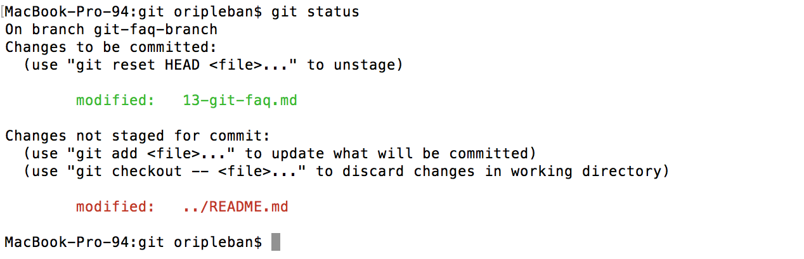

# Git 13: FAQ

<br/>
So you feel lost at git.

### What should you do when you open up your terminal?

* Check to see what branch you're on: <br/>
  `git branch -v`

  ```
  MacBook-Pro-94:git oripleban$ git branch -v
  * git-faq-branch    fb3998f Updates git FAQ
    master            01b8566 Merge branch 'master' of github.com:code4policy/modules
  ```

* Check to see what files have changed in your repo: <br/>
  `git status`



* Unstaged changes since your last commit will appear in red. Staged changes will appear in green. In general it's good practice to clean up your workspace when you are done for the day. Try to keep your git workspace tidy and commit all of your changes before finishing up for the day.

### So you're ready to push up your local changes to your remote (GitHub), what should you do?

* Make sure you've staged all any changes: <br/>
  `git status`

* Add any untracked changes you'd like to include in your commit: <br/>
  `git add <file>` or `git add *` to stage all modified files.

* Commit those changes: <br/>
  `git commit -m "<YOUR WONDERFUL COMMIT MESSAGE>"`

* Pull down any recent changes from your remote that may not be in your local repo: <br/>
  `git pull` or `git pull origin <branch name>`

* If necessary, resolve any merge conflicts and commit those changes. Merge conflicts will appear in your files surrounded by `<<<<` and `====`. Go through and remove those brackets keep only the changes you want in your commit.

```
<<<<<<<<<<<<<<<< HEAD
This line comes from head
===================
This line comes from cool-branch
>>>>>>>>>>>>>>>>>> cool-branch
```

* Resolve any merge conflicts, then stage and commit those changes: <br/>
`git add <file>` <br/>
`git commit -m "<YOUR WONDERFUL COMMIT MESSAGE>"`

* Now you can push up your changes: <br/>
`git push` or `git push origin <branch name>`

### Why can't I `git push`?

#### You are not in a git repo
  ```
  fatal: Not a git repository (or any of the parent directories): .git
  ```
  You are not in a git repo. Make sure you are in the right directory or `git init` to initialize git in the current directory.
  <br/>

#### You aren't a collaborator on GitHub

  ```
  MacBook-Pro-94:wiki_trust oripleban$ git push
  ERROR: Permission to xxxxxxxxx/wiki_trust.git denied to opleban.
  fatal: Could not read from remote repository.
  ```

* Check that you have the correct access rights and that the repository exists. Make sure that you are a collaborator on the remote repo (GitHub).
  <br/>

#### Your SSH keys are not setup

  ```
  git push
  Permission denied (publickey).
  fatal: Could not read from remote repository.
  ```

* Make sure your SSH keys are [set up correctly](https://help.github.com/articles/connecting-to-github-with-ssh/).

#### Your remote is not setup

  ```
  MacBook-Pro-94:ori_tools oripleban$ git push
  fatal: No configured push destination.
  Either specify the URL from the command-line or configure a remote repository using

    git remote add <name> <url>

  and then push using the remote name

    git push <name>
  ```

  * Make sure your local repo is tracking a remote remote GitHub repo. You can check if there is a remote set up with `git remote -v`. If you don't see a remote listed, you can create one and push changes to the remote like this:

  ```
  git remote add origin git@github.com:<USERNAME>/<REPO>.git
  git push -u origin master
  ```

## Other Useful Resources
* [Github GIT Cheatsheet](https://services.github.com/on-demand/downloads/github-git-cheat-sheet.pdf)
* [Oh Shit, Git!](https://github.com/AlJohri/DAT-DC-12/blob/master/notebooks/intro-git.ipynb)
* [GIT FAQ](http://gitfaq.org/)

