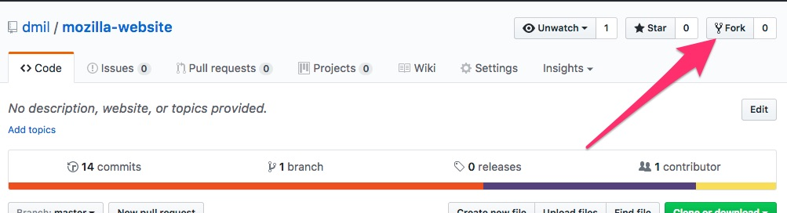
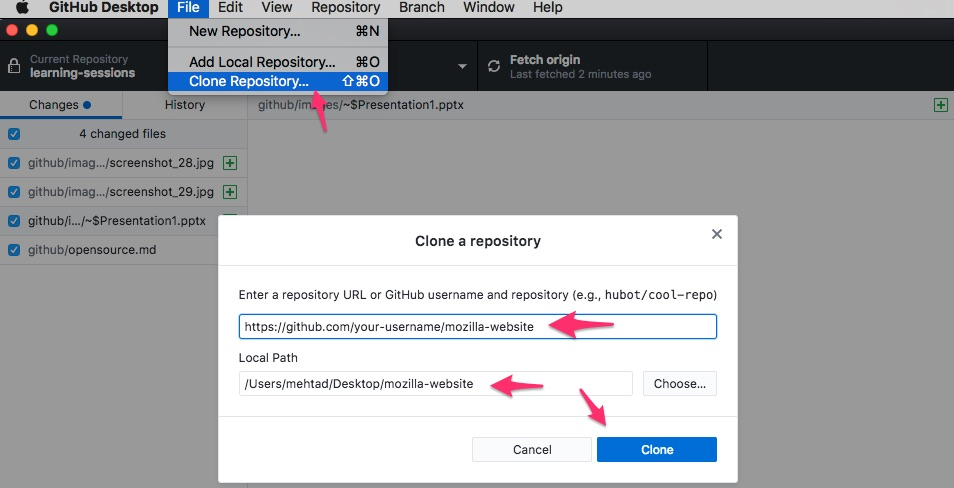
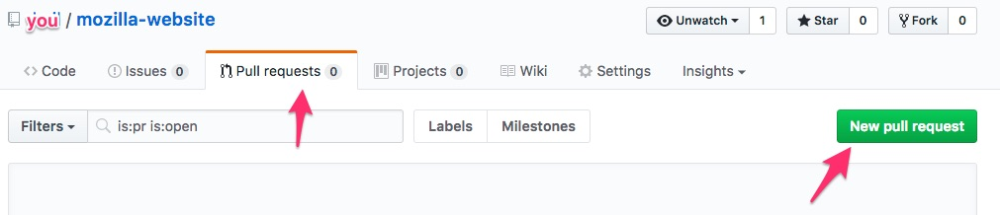

# Open Source (and forking)

## Branching vs Forking

* **Branching** is a feature of Git, you've used branching already
* **Forking** is a feature of GitHub
	* 	A fork is a personal copy of another user's repository that lives on your account. Forks allow you to freely make changes to a project without affecting the original. Forks remain attached to the original, allowing you to submit a pull request to the original's author to update with your changes. You can also keep your fork up to date by pulling in updates from the original. - [GitHub Glossary](https://help.github.com/articles/github-glossary/)
	*  When you fork a repository, you get all of the branches the other person posted on GitHub
	*  Pull requests however, don't acknowledge forks since they are a feature of GitHub and not Git

### Step 1: Fork a copy of my `mozilla-website` repository into your own account!

This

https://github.com/`dmil`/mozilla-website

will fork to 

https://github.com/`your-username`/mozilla-website

If you want to see the site rendered in your GitHub pages, go to Settings > GitHub Pages and select the "master" branch to render the page from.

### Step 2: Make ONE change!

**Make Changes on GitHub**

The short way to do this is to just make the changes directly in the GitHub web editor in the `your-username/mozilla-website` repository's `master` branch. 

**Optional (make changes locally instead)**

If you want to get some more practice with GitHub though, you can clone the repository locally onto your Desktop. Make the changes, commit them, and then push the new commits from your **local** `master` branch to your **remote** `master` branch in GitHub.

### Step 3: Issue a pull request back to my repository

Issue a pull request back from the `master` branch of the `your-username/mozilla-website` to the `master` branch of `dmil/mozilla-website`

### Step 4: Wait for me to approve the pull request and see the change on my site.

compare

http://dmil.github.io/mozilla-website

with

http://`your-username`.github.io/mozilla-website

### Step 5: Woohoo! You just collaborated open-source.

Open source collaboration is great for:

* Not duplicating work
* Collaborating accross organizations
* Interacting with people - sometimes making an issue or a pull request can lead to friendship (or sources or collaborators)
* Reader feedback
* [Collective debugging](https://github.com/themarshallproject/klaxon/issues/107), finding critical [errors](https://github.com/fivethirtyeight/data/pull/54) faster (often also leads to better security and better data quality).
* [Building upon](https://twitter.com/ascheink/status/783394500710457344) someone else's project
* [Feuding](https://github.com/jashkenas/underscore/issues/2182)
* [Philosophical](https://www.gnu.org/philosophy/shouldbefree.en.html) [Reasons](https://www.gnu.org/philosophy/open-source-misses-the-point.en.html)
* Being [nerdy](https://github.com/fivethirtyeight/data/pull/63)?
