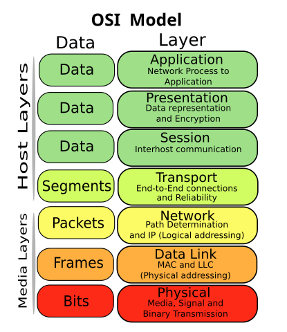

# Internet

## Websites on the Internet

How do they work?

https://projects.propublica.org/graphics/images/data-institute/presentations/how-websites-work.pdf

## Internet Basics

https://developer.mozilla.org/en-US/docs/Learn/Common_questions/How_does_the_Internet_work

* Internet - a network of networks
* "World Wide Web" - a service built on top of the internet's infrastructure (other services include e-mail and IRC chat, neither of which use HTTP)
	* HTML - Hypertext Markup Language
	* HTTP - Hypertext Transfer Protocol

## DNS Lookup


Source: [Mozilla Developer Network](https://developer.mozilla.org/en-US/docs/Learn/Common_questions/What_is_a_domain_name)

#### ❇️ Example

There are lots of programs that can resolve a domain name for you, one of those is [`dig` (domain information groper)](https://www.tecmint.com/10-linux-dig-domain-information-groper-commands-to-query-dns/).

```
dig google.com +short
```

#### ❇️ Example

Let's set up a custom domain!

1. In the GitHub repo, create a file called CNAME with the name of the domain
2. Set up the apex domain name to point to GitHub's servers in Namecheap:
	
	https://help.github.com/en/github/working-with-github-pages/managing-a-custom-domain-for-your-github-pages-site#configuring-an-apex-domain
	
3. Check that the domain is correct using `dig`


## Routing

Data travels sent over the internet is chopped up and sent in packets. Here is [what an IP packet looks like](https://en.wikipedia.org/wiki/Network_packet#Example:_IP_packets). It has a **header** which contains the metadata and a **payload** which contains the data. Different protocols handle packets differently. For example, some protocols like those you might use to stream video will tolerate packet loss, other protocols like TCP/IP which is used to transmit websites don't).

Routers route those packets to their correct destinations based on the metadata the packet carries.

https://en.wikibooks.org/wiki/A-level_Computing/AQA/Computer_Components,_The_Stored_Program_Concept_and_the_Internet/Structure_of_the_Internet/Packet_switching

Here is a strange videos:

* [Animated Packets](https://www.youtube.com/watch?v=L8VpthhRaEg)

#### ❇️ Example

You can use traceroute to see how your request is routed to its destination.

```
traceroute google.com
```

## The Internet has Layers


Source: [Wikimedia Commons](https://commons.wikimedia.org/wiki/File:Osi-model-jb.svg)

If you're really interested:

* https://www.lifewire.com/open-systems-interconnection-model-816290
* https://www.lifewire.com/layers-of-the-osi-model-illustrated-818017

And if you're not:

*  [Networks have layers!](https://www.youtube.com/watch?v=NxwNcgEjWBo)
