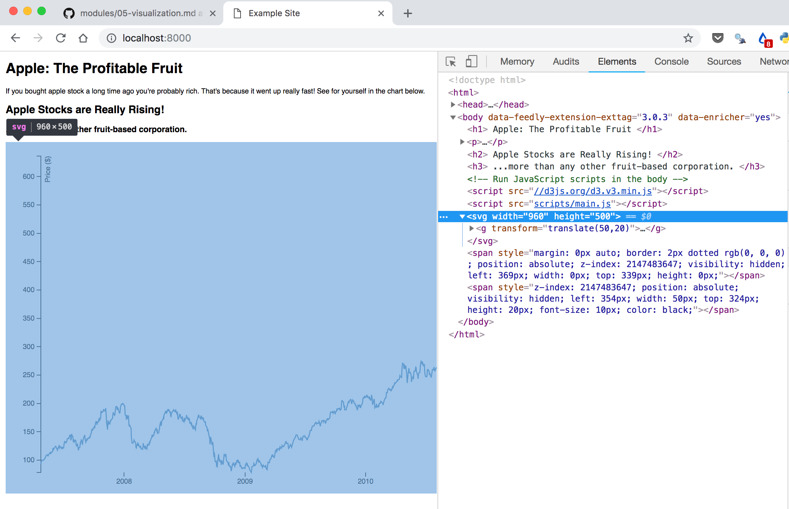
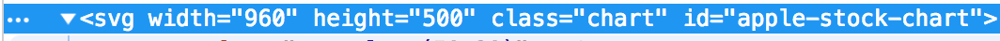

# Visualizing Data

## D3 JS (Data Driven Documents)
D3 JS

* [https://d3js.org/](https://d3js.org/)
* [https://github.com/d3/d3/wiki/Gallery](https://github.com/d3/d3/wiki/Gallery)

Grammar of Graphics

* [https://www.amazon.com/Grammar-Graphics-Statistics-Computing/dp/0387245448](https://www.amazon.com/Grammar-Graphics-Statistics-Computing/dp/0387245448)

What D3 is Not

* [http://ruoyusun.com/2014/05/26/what-d3js-is-not.html](http://ruoyusun.com/2014/05/26/what-d3js-is-not.html
)

## Getting Started

Lets grab some code from a basic D3 visualization and get it up and running on a website. We'll use this line chart to start with: https://web.archive.org/web/20161225091855/http://bl.ocks.org/mbostock/3902569

###  Example - Part 1

Lets create a new webpage with a D3 visualization in it. We'll call this `chart-example`.

1. Create a [new repository](https://github.com/new) in GitHub called `chart-example`. Intialize it with a README.

2. Clone the new repo into your Development folder

	```
	cd ~/Development
	git clone git@github.com:XXXXXX/chart-example.git
	ls
	```
3. Create an `index.html` and a `data.tsv` and open the folder with Sublime Text.

	```
	cd chart-example
	touch index.html
	touch data.tsv
	subl .
	```
4. Grab the code from the [example d3 visualization](https://web.archive.org/web/20161225091855/http://bl.ocks.org/mbostock/3902569) (observable version: https://observablehq.com/@d3/line-chart-with-tooltip) and put it in `index.html`, grab the data and put it in `data.tsv`


5. Now if you run a simple HTTP server, the code will run.

	```
	python3 -m http.server 8000
	```

6. Once you're sure it works, lets commit and push that.

	```
	git add index.html
	git add data.tsv
	git commit -m "add a chart of apple stock prices"
	git push
	```

## Splitting out HTML, CSS, and JavaScript
The problem with this is that the HTML is ill-formed (there is no head and body). Also the CSS and the JavaScript is all in the same file as the HTML. Messy! I will demand that you always keep them separated for this class. Lets go ahead and do that.


Remember, a good HTML document has a head and body.

```html
<!DOCTYPE html>
<html>

<head>
  <title> Example Site </title>
</head>

<body>
</body>

</html>
```

You can link a separate CSS file with the following code. Remember, linking CSS always happens in the **\<head> \</head>** of the document.

```html
<link href="styles/style.css" rel="stylesheet" type="text/css">
```

You can call a JavaScript file like with this code. In this case we're linking one peice of code (the D3 library itself) from a website, and another peice of code (our specific chart) form a local file. Javascript is customarily placed at the end of the **\<body> \</body>** of the document. It is usually the last line before you close the body tag.

```html
<script src="//d3js.org/d3.v3.min.js"></script>
<script src="scripts/chart.js"></script>
```

###  Example - Part 2

1. Split out the JavaScript and CSS into separate files. Your directory structure should look something like this now:
	
	```
	.
	├── data.tsv
	├── index.html
	├── scripts
	│   └── main.js
	└── styles
	    └── style.css
   ```


2. Import those files into your HTML. Your `index.html` might look something like this now:

	```html
	<!DOCTYPE html>
	<html>
	
	<head>
		<title> Example Site </title>
		<!--Load StyleSheets in the head-->
		<link href="styles/style.css" rel="stylesheet" type="text/css">
	</head>
	
	<body>
		<h1> Apple: The Profitable Fruit </h1>
	
		<p> If you bought apple stock a long time ago you're probably rich. That's because it went up really fast! See for yourself in the chart below. </p>
	
		<h2> Apple Stocks are Really Rising! </h2>
		<h3> ...more than any other fruit-based corporation. </h3>
	
		<!-- Run JavaScript scripts in the body -->
		<script src="//d3js.org/d3.v3.min.js"></script>
		<script src="scripts/main.js"></script>
	</body>
	
	</html>
	```
3. Commit and push to GitHub

## Avoiding Conflicting CSS

Right now the chart works fine, however, that is because the chart is the only thing on the page. The CSS in these example D3 examples often assume the D3 is the only thing on the page. So if there were other things on the page, the CSS might also end up applying to those things as well! To avoid that, we must specify that the CSS only apply to the chart. Lets modify the CSS selectors to do just that.

### Using `id` and `class` tags Properly

If you look closely at `index.html`, you'll notice that there is no element in the HTML code for the chart. That's because the chart is being generated by the JavaScript file. After the HTML is initially loaded, the JavaScript code runs and creates an `<svg></svg>` element on the page containing the chart. (SVG stands for "Scalable Vector Graphic"). You can see that by right clicking on the chart and hitting "inspect" as shown below:



So lets suppose we wanted to add an `id` and a `class` attribute to that SVG tag. How would we do that without knowing JavaScript? Lets look at the code and try to deduce how.

You'll notice the SVG element in the image above contains a `width` and a `height`. We can first figure out how those came to be and then use the same mechanism to write additional attributes like `class` or `id`.

If you look inside the JavaScript file that generates the chart, and try to read it, you'll find the following:

```javascript
var svg = d3.select("body").append("svg")
    .attr("width", width + margin.left + margin.right)
    .attr("height", height + margin.top + margin.bottom)
```

Notice how that code is adding a width and a height attribute? We can add an id attribute in the same way.

```javascript
var svg = d3.select("body").append("svg")
    .attr("width", width + margin.left + margin.right)
    .attr("height", height + margin.top + margin.bottom)
    .attr("class", "chart")
    .attr("id", "apple-stock-chart")
```

This change will change the SVG to include a `class` and an `id`



Finally, we can modify the CSS to **only** match this chart by adding a new id selector (`#apple-stock-chart`) to each style so that the style doesn't spill over and start to conflict with other charts. Your CSS may ultimately look like this:

```css
body {
  font: 10px sans-serif;
}

#apple-stock-chart .axis path,
#apple-stock-chart .axis line {
  fill: none;
  stroke: #000;
  shape-rendering: crispEdges;
}

#apple-stock-chart .x.axis path {
  display: none;
}

#apple-stock-chart .line {
  fill: none;
  stroke: steelblue;
  stroke-width: 1.5px;
}

#apple-stock-chart .overlay {
  fill: none;
  pointer-events: all;
}

#apple-stock-chart .focus circle {
  fill: none;
  stroke: steelblue;
}
```

###  Example - Part 3

1. Modify the JavaScript code for the chart so that it appends a `class=chart` and `id=apple-stock-chart` when it generates the chart.
2. Modify the CSS so that it applies only to the `apple-stock-chart` and doesn't spill over to any other charts that may be on the page.
3. Commit and push to GitHub


##  Try It (Bonus)

Lets take your line chart and append it to the bottom of your Mozilla Webpage.

1. Go to your mozilla website on your computer and make sure you're in the master branch.

	```
	cd ~/Development/mozilla-website
	git checkout master
	git pull
	```

2. Create a new branch called `add-chart`

	```
	git checkout -b add-chart
	```
3. Get the chart to appear at the bottom of the Mozilla website. Make sure none of the CSS syles for the chart spill over into the rest of the webpage!

4. Go to GitHub and issue a pull request. Merge that branch back into master. View the website online.

## Project Note

If you're planning to use D3 for the MVP of your project, you can find some great templates at


- http://bl.ocks.org/mbostock (Mike Bostock created D3JS, these are his examples)
- http://bl.ocks.org/ (same website, examples by different people)
- https://github.com/d3/d3/wiki/Gallery
- http://christopheviau.com/d3list/gallery.html
- https://d3js.org/


Some of these pre-created D3 visualizations take in CSV format (like the simple example that we did above). Others take in a JSON format. We will be talking in class about converting between CSV and JSON formats using python. If you find that you want to use a data visualization, but are not sure how to connect the dataset to the visualization, have someone in your project group chat with me.

## Organizing your Code

Some additional notes on code organization.

[https://developer.mozilla.org/en-US/docs/Learn/Getting_started_with_the_web/Dealing_with_files](https://developer.mozilla.org/en-US/docs/Learn/Getting_started_with_the_web/Dealing_with_files)
